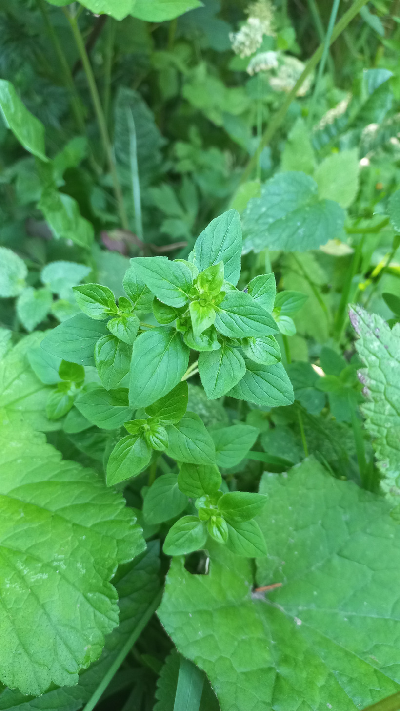

# Pamajorán obyčajný
- Lat.: Origanum vulgare
- En.: Oregano

Čeľaď: Hluchavkovité

- Trváca bylina do výšky 1m
- Obsahuje voňavé silice
- Liečivá bylina

Zdr:
- https://zdravopedia.sk/prirodna-lekaren/bylinky/oregano-pamajoran-obycajny
- https://www.medicalnewstoday.com/articles/266259