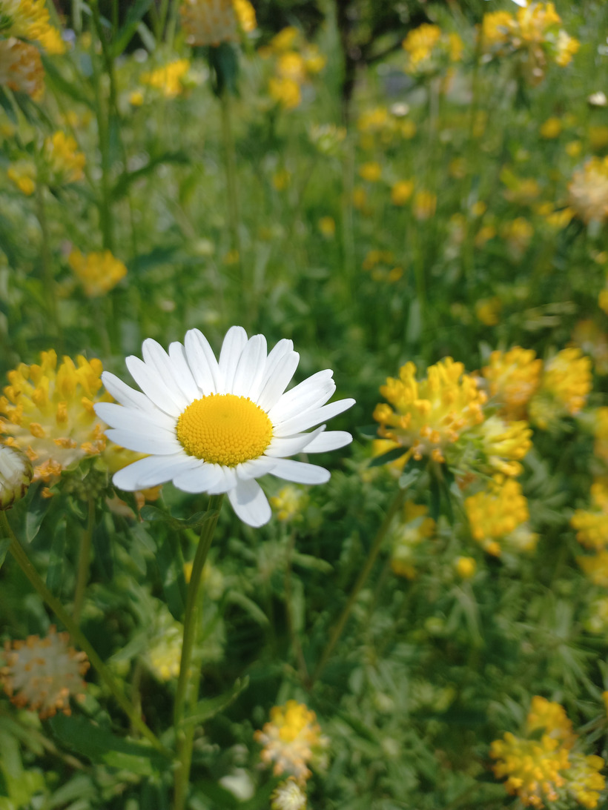

# Margarétka obyčajná
- Lat.: Leucanthemum vulgare
- En.: Ex-eye daisy

Čeľaď: Astrovité (Asteraceae)

- 20cm trváca bylina
- Rastie skoro v celej južnej a strednej Európe
- Uznávaná rastlina v ľudovej medicíne

Zdr:
- https://botany.cz/cs/leucanthemum-vulgare/