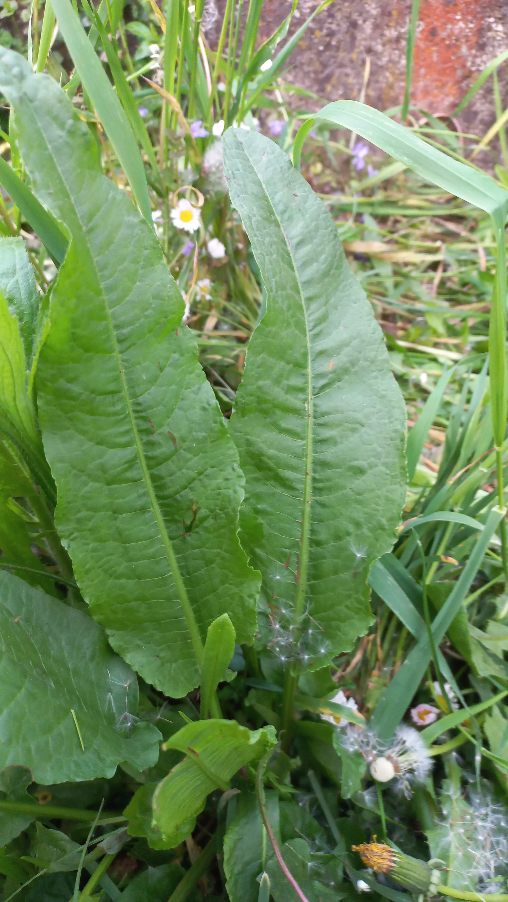

# Štiav záhradný
- Lat.: Rumex patientia
- En.: Patience dock

Čeľaď: Stavikrvovité (Polygonaceae)

- Nenáročná trvalka
- Darí sa jej v živných, vlhkých pôdach a na polotieňi
- Bohatá na vitamíny A, B, C, E, K

Zdr:
- https://www.prirodaplus.sk/zive-bylinky-a-rastlinky-v-kvetinacoch/stiav-zahradny-rumex-patientia-l