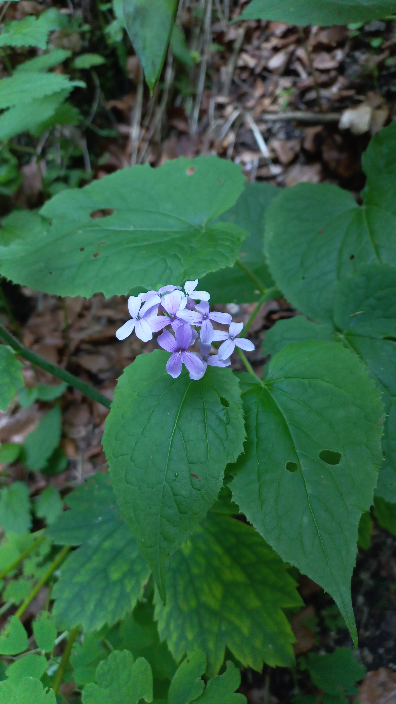
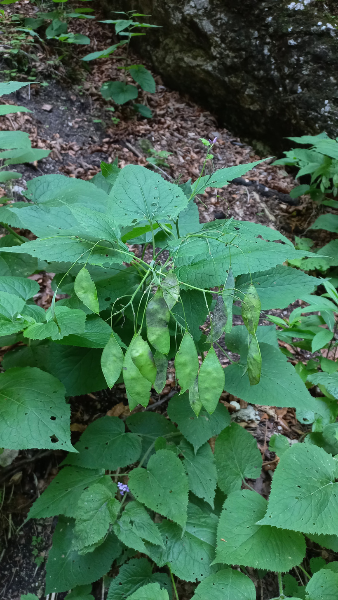

# Mesačnica trváca
- Lat.: Lunaria rediviva
- En.: Perennial honesty

Čeľaď: Brassicaceae

- Až 120cm vysoká bylina
- Rastie v lesoch, priekopách vedľa ciest
- Liečivá ohrozená rastlina

Zdr:
- https://www.nahuby.sk/atlas-rastlin/Lunaria-rediviva/mesacnica-trvaca/mesicnice-vytrvala/ID7991