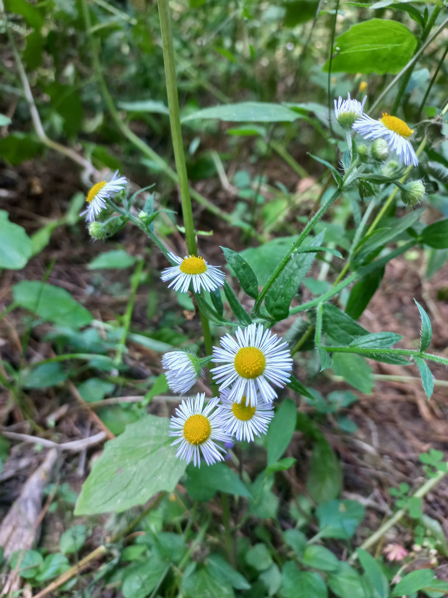

# Hviezdnik ročný
- Lat.: Stenactis annua
- En.: Philadelphia fleabane

Čeľaď: Astrovité (Asteraceae)

- Trváca bylina
- Dorastá 20-150cm
- Pochádza zo severnej Ameriky

Zdr:
- https://mojerastliny.sk/hviezdnik-rocny/