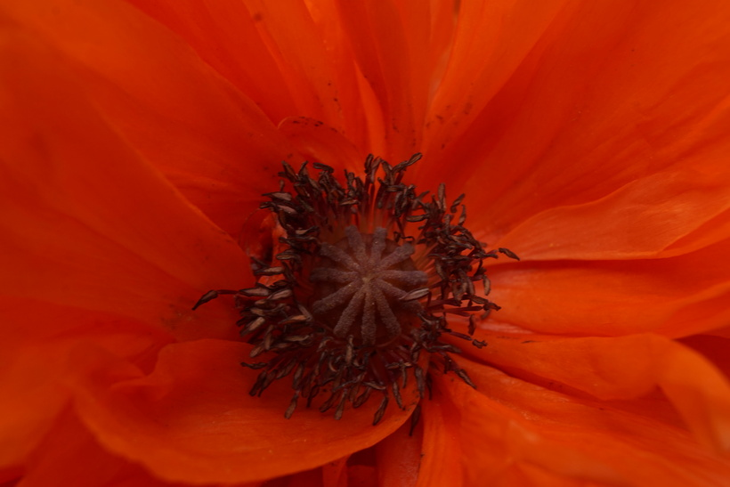

# Mak siaty
- Lat.: Papaver somniferum
- En.: Opium poppy

Čeľaď: Makovité (Papaveraceae)

- Jednoročná bylina
- Pochádza z východnej Indie a Turecka
- Suché semená obsahujú 12x viac vápnika ako mlieko

Zdr.:
- https://bylinke.sk/sk/stranka/bylinky/mak-siaty
- https://www.krasaastyl.sk/mak-siaty-pestovanie-a-zdravotne-ucinky/