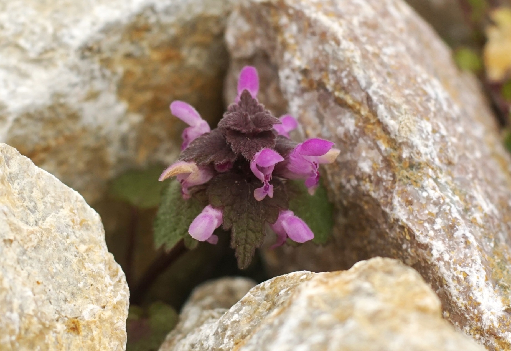

# Hluchavka nachová
- Lat.: Lamium purpureum
- En.: Purple deadnettle

Čeľaď: Hluchavkovité

- Širokospektrálne liečivé účinky
- Mladé výhonky, listy a kvety sú jedlé
- Vhodná rastlina aj do šalátov a polievok

Zdr.:
- https://chkopolana.sopsr.sk/jedla-divokost/hluchavka