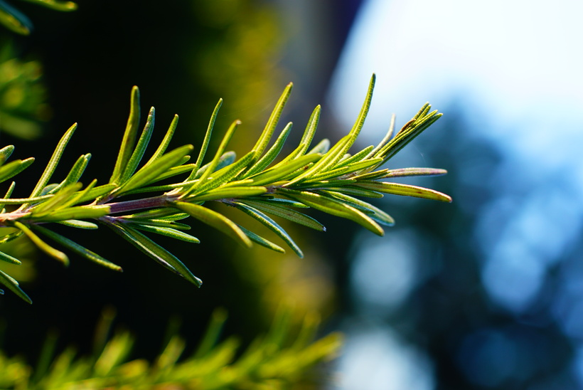

# Rozmarín lekársky
- Lat.: Salvia rosmarinus
- En.: Rosemary

Čeľaď: Hluchavkovité

- Drevitá viacročná bylina
- Ihličkovité 2-4cm listy
- Dorastá 150cm

Zdr.:
- https://zdravopedia.sk/prirodna-lekaren/bylinky/rozmarin-lekarsky