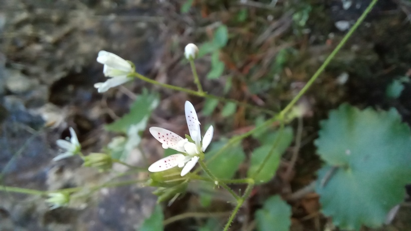

# Lomikameň okrúhlolistý
- Lat.: Saxifraga rotundifolia
- En.: Round-leaf saxifrage

Čeľaď: Lomikameňovité (Saxifragaceae)

- Vytrvalá, 30-50cm bylina
- Rastie v horských lesoch
- Zákonom chránený v Taliansku, Švajčiarsku a Nemecku

Zdr:
- https://botany.cz/cs/saxifraga-rotundifolia/
- https://www.nahuby.sk/atlas-rastlin/Saxifraga-rotundifolia/lomikamen-okruhlolisty/lomikamen-okrouhlolisty/ID7984