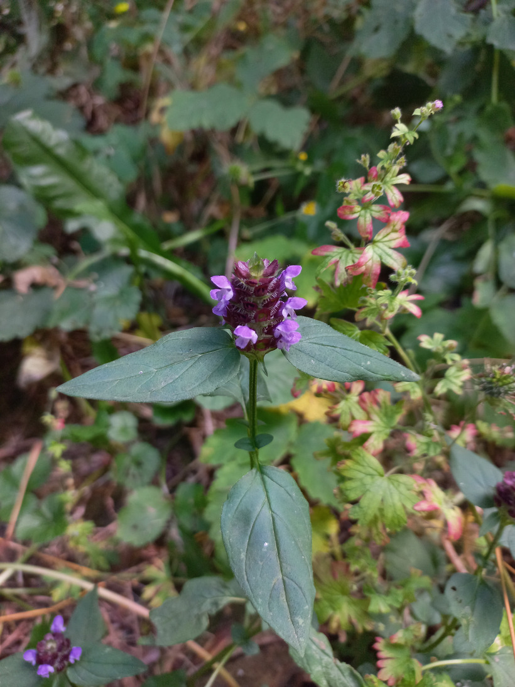

# Čiernohlávok obyčajný
- Lat.: Prunella vulgaris
- En.: Self-heal

- Trváca bylina
- Odoláva teplotám do -34°C
- Kalichy sa po odkvitnutí zmenia na tmavohnedý semenník

Zdr.:
- https://www.zahrada.sk/magazine/ciernohlavok-obycajny-bozia-spasa-nasich-luk/