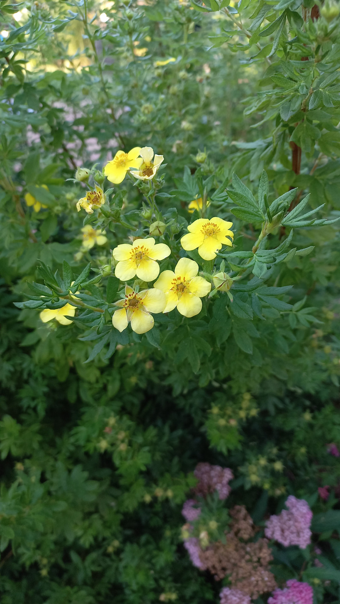

# Nátržník krovitý 
- Lat.: Dasiphora fruticosa
- En.: Shrubby Cinquefoil

Čeľaď: 

- Okrasný ker
- Opadavý
- Do 70cm
- Rôzne druhy s rôznymi farbami kvetov

Zdr.:
- https://www.stromo.sk/natrznik-krovity-princess