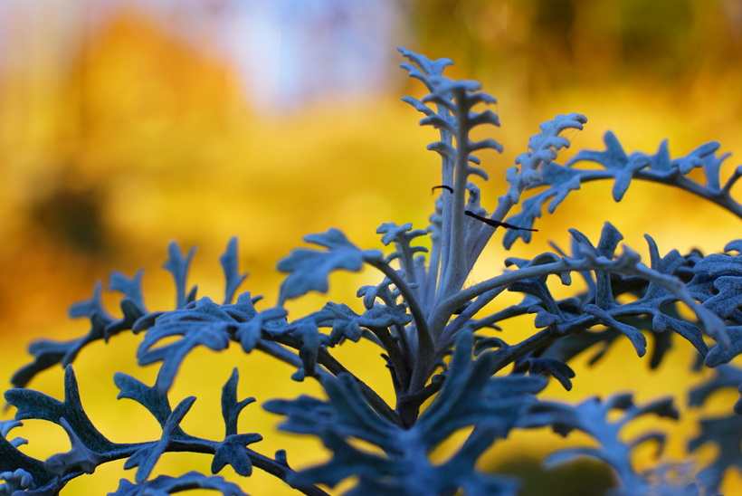

# Starček prímorský
- Lat.: Jacobaea maritima
- En.: Silver ragwort

Čeľaď: Astrovité (Asteraceae)

- Neopadavý poloker
- Zvládne teploty do -15°C
- Dorastá do výšky 30-60cm

Zdr:
- https://mojerastliny.sk/starcek-primorsky/