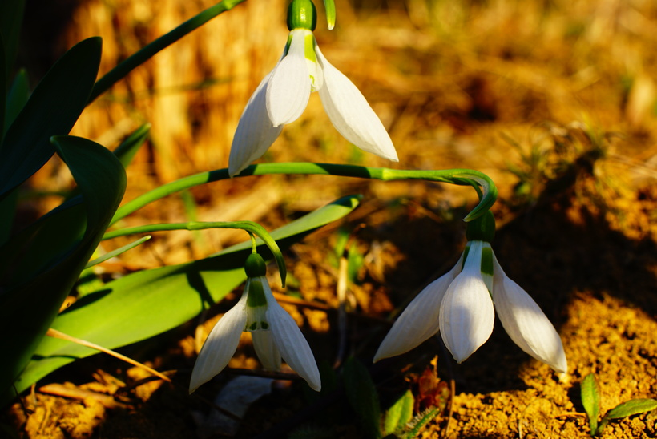

# Snežienka jarná
- Lat.: Galanthus nivalis
- En.: Snowdrop

Čeľaď: 

- Trváca 15-30cm bylina
- Zákonom chránený ohrozený druh
- Látkovou premenou vytvoria teplo, odolajú teda nízkym jarným teplotám
- Svoje bezprostredné okolie dokážu zohriať až na 10°C
- Kvitnú až po 4-5 rokoch

Zdr:
- https://www.sopsr.sk/web/?cl=20992
- https://zahradkar.pluska.sk/okrasna-zahrada/kvitnu-precitajte-vsetko-tychto-krehkych-bielych-kvietkoch
- https://mojerastliny.sk/snezienka-jarna/
- https://www.osiva-semena.sk/snezienka-jarna-galanthus-nivalis-cibuloviny-3-ks