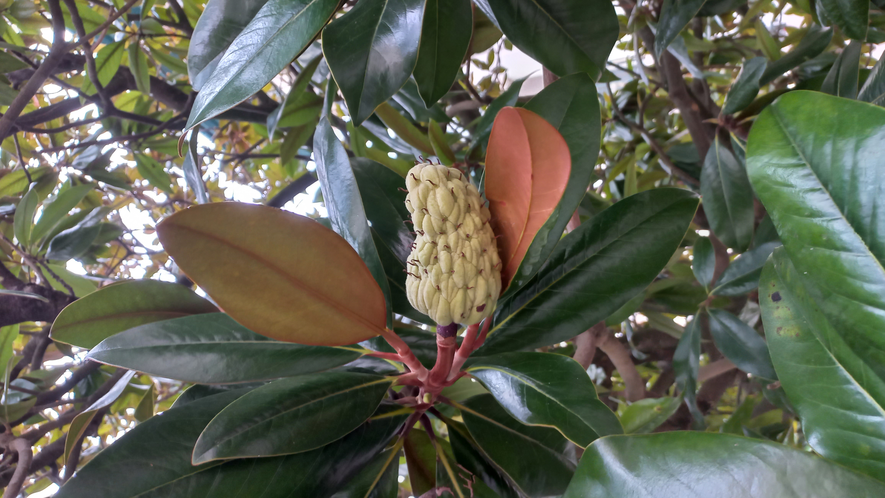

# Magnólia veľkokvetá
- Lat.: Magnolia grandiflora
- En.: Southern magnolia

Čeľaď: 

- Stálozelený druh
- Pochádza z Ameriky
- Príjemne voňavé biele kvety

Zdr:
- https://www.slovensketrvalky.sk/produkt/magnolia-grandiflora
- https://www.eflora.sk/kategoria/okrasne-dreviny/magnolie-azalky-camelie-a-rododendrony/magnolia-grandiflora-gallisoniensis/