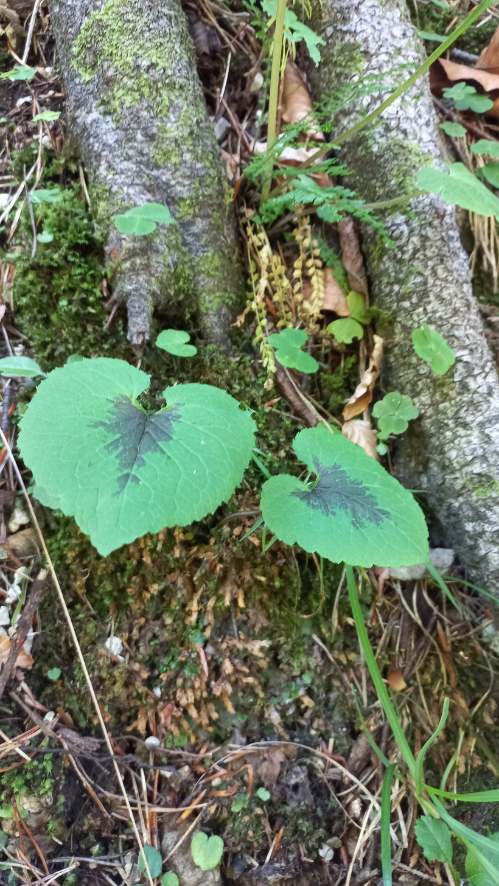

# Zerva klasnatá
- Lat.: Phyteuma spicatum
- En.: Spiked Rampion

Čeľaď: Zvončekovité (Campanulaceae)

- Trváca 15-80cm bylina s prízemnou ružicou
- Rastie priamo hore bez vetvenia

Zdr.:
- https://www.nahuby.sk/atlas-rastlin/Phyteuma-spicatum/zerva-klasnata/zvonecnik-klasnaty/ID8661
- https://botany.cz/cs/phyteuma-spicatum/