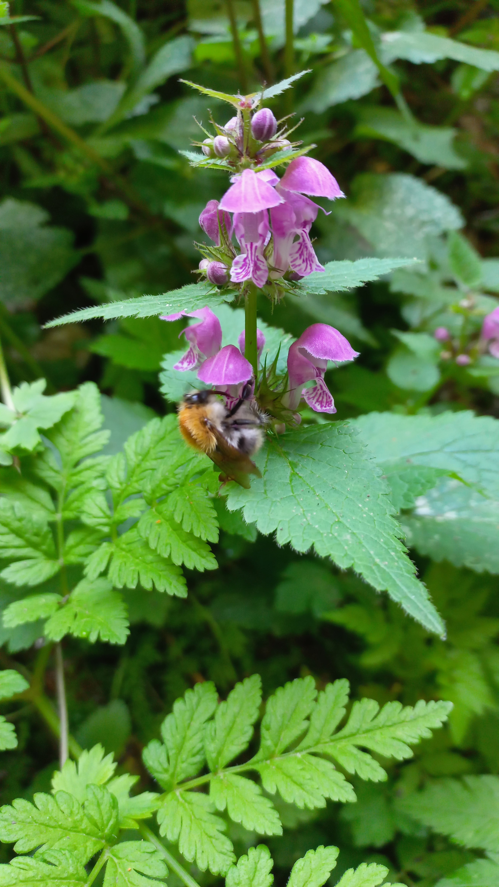

# Hluchavka škvrnitá
- Lat.: Lamium maculatum
- En.: Spotted dead-nettle

Čeľaď: Hluchavkovité

- Trváca bylina
- Dorastá 20-40cm
- Listy sú protistojné

Zdr.:
- https://mojerastliny.sk/hluchavka-skvrnita/