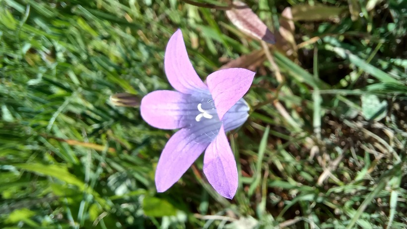

# Zvonček konáristý
- Lat.:
- En.: Spreading bellflower

Čeľaď: Zvončekovité (Campanulaceae)

- Dvojročná bylina
- Rozšírený v celej Európe
- Rastie najmä na lúkach

Zdr.:
- https://botany.cz/cs/campanula-patula/