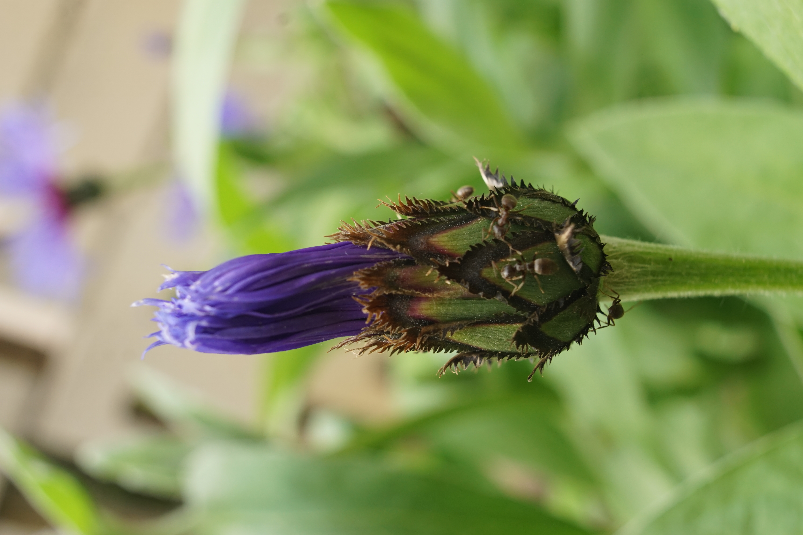

# Nevädza
- Lat.: Centaurea depressa
- En.: Squarrose knapweed

Čeľaď: Astrovité (Asteraceae)

- Rastie v juhovýchodnej Európe a Ázii
- Vyhľadáva suché slnečné stanoviská
- Často nájditeľná na horských poliach

Zdr.:
- https://botany.cz/cs/centaurea-depressa/