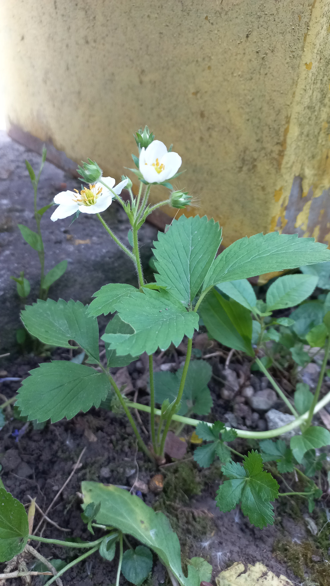

# Jahoda obyčajná
- Lat.: Fragaria × ananassa
- En.:

Čeľaď: Ružovité (Rosaceae)

- Hybridný druh
- Trváca rastlina
- Tvorí prízemné ružice
- Rozmnožuje sa aj vegetatívne

Zdr.:
- https://mojerastliny.sk/jahoda-obycajna/