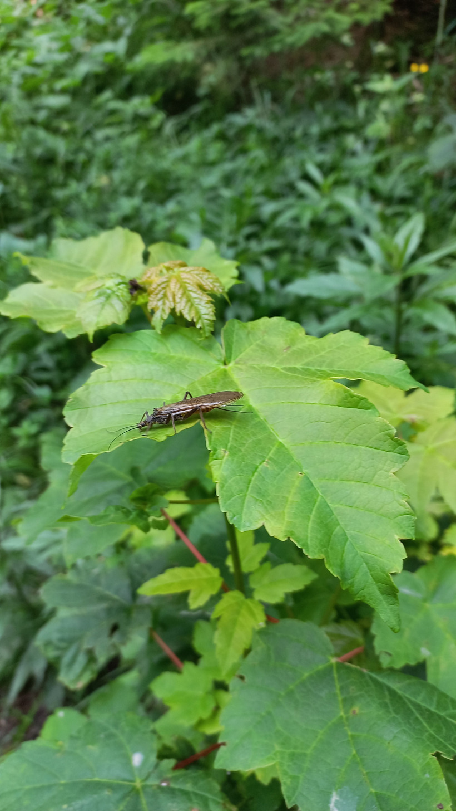

# Javor horský
- Lat.: Acer pseudoplatanus
- En.: Sycamore maple

Čeľaď: Mydlovníkovité (Sapindaceae)

- Dorastá do výšky 3-5m
- 5-laločnaté listy
- Mrazuvzdorný do -34°C

Zdr.:
- https://www.nahuby.sk/atlas-rastlin/Acer-pseudoplatanus/javor-horsky/javor-klen/ID8369
- https://www.zahradnici.sk/index.php?route=product/product&product_id=1602