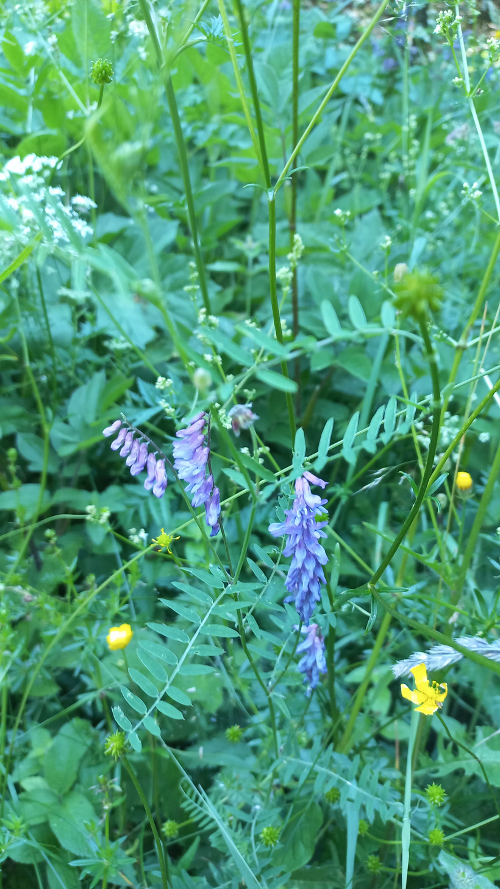

# Vika vtáčia
- Lat.: Vicia cracca
- En.: Tufted vetch

Čeľaď: Bôbovité (Fabaceae)

- Popínavá trváca bylina
- Párne perovito zložené listy
- Rastie na slnečných lúkach

Zdr:
- https://www.nahuby.sk/atlas-rastlin/Vicia-cracca/vika-vtacia/vikev-ptaci/ID8036