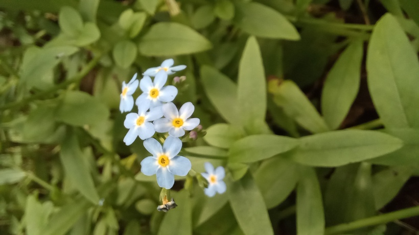

# Nezábudka močiarna
- Lat.: Myosotis scorpioides
- En.: Water forget-me-not

Čeľaď: Boraginaceae

- Trváca bylina
- Tvorí podzemky
- Rastie na lesných čistinkách, vedľa vodných tokov

Zdr:
- https://www.nahuby.sk/atlas-rastlin/Myosotis-scorpioides/nezabudka-mociarna/pomnenka-bahenni/ID10289
- https://www.dreviny.sk/2423-nezabudka-mociarna-myosotis-palustris-myosotis-scorpioides/