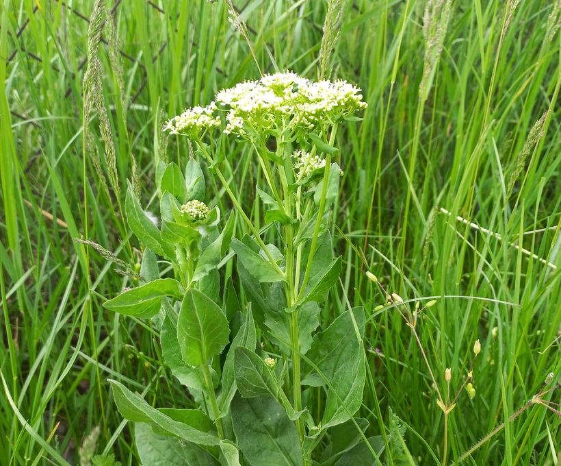

# Vesnovka obyčajná
- Lat.: Cardaria draba
- En.: Whitetop

Čeľaď: Brassicaceae

- Trváce byliny
- Tučné listy
- Celá rastlina pokrytá vrstvou vosku

Zdr.:
- https://www.nahuby.sk/atlas-rastlin/Cardaria-draba/vesnovka-obycajna/vesnovka-obecna/ID9899