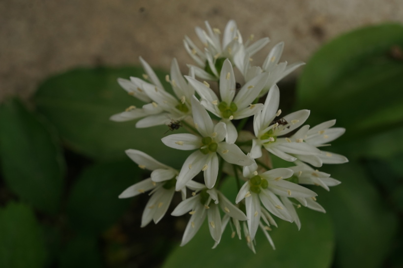

# Cesnak medvedí
- Lat.: Allium ursinum
- En.: Wild garlic

Čeľaď:

- Známa voľne rastúca bylina
- Dlhé kopijovité listy
- Rastie vo vlhkých a kyprých pôdach

Zdr.:
- https://www.slovensketrvalky.sk/produkt/allium-ursinum