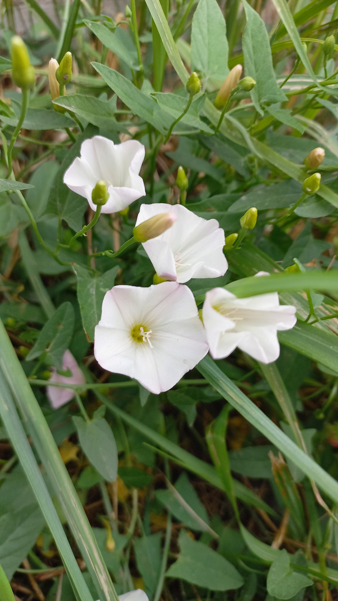

# Povoja
- En.: Wild Morning Glory
- Lat.: Calystegia hederacea

- Vytrvalá, popínavá rastlina
- Tobolka - cca 1cm
- Druh z východnej a južnej Ázie
- Tento druh v strednej Európe neexistoval pred 2. pol. 20. storočia

Zdr.: 
- http://www.cukr-listy.cz/on_line/2011/PDF/21-25.pdf
- https://www.nahuby.sk/atlas-rastlin/Calystegia-hederacea/povoja/opletnik-brectanovity/ID15287