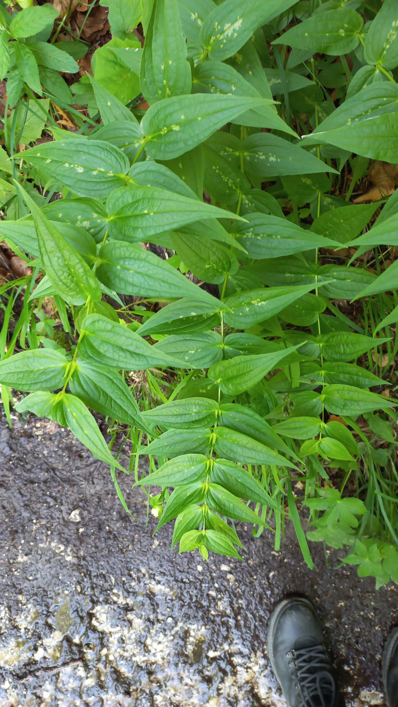

# Horec luskáčovitý
- Lat.: Gentiana asclepiadea
- En.: Willow gentian

Čeľaď: Horcovité (Gentianaceae)

- 20-60cm trváca bylina
- Nachádza sa na okrajoch horských lesov
- Priame, nerozkonárené byľe

Zdr:
- https://mojerastliny.sk/horec-luskacovity/