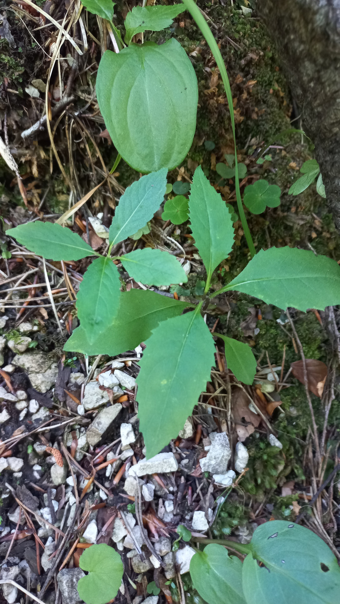

# Starček vajcovitolistý
- Lat.: Senecio ovatus
- En.: Wood ragwort

Čeľaď: Asteraceae

- Trváca bylina
- 40-100cm vysoká
- Striedavé kopijovité listy

Zdr.:
- https://www.nahuby.sk/atlas-rastlin/Senecio-ovatus/starcek-vajcovitolisty/starcek-Fuchsuv/ID7942
- https://mojerastliny.sk/starcek-fuchsov/