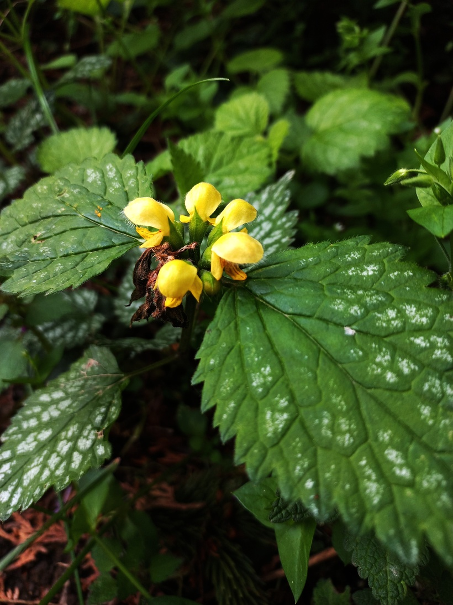

# Hluchavník žltý
- Lat.: Lamium galeobdolon
- En.: Yellow archangel

Čeľaď: Hluchavkovité

- Trváca bylina
- Obľubuje vlhkú pôdu a polotieň
- Liečivá rastlina

Zdr.:
- https://www.nahuby.sk/atlas-rastlin/Galeobdolon-luteum/hluchavnik-zlty/pitulnik-zluty/ID8288
- http://www.slovenskyvyrobca.sk/kategoria/hluchavka
