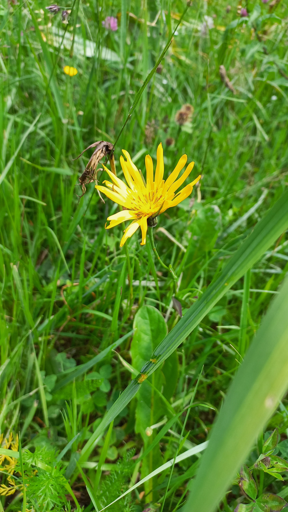

# Kozobrada kyjačikovitá
Lat.: Tragopogon dubius
En.: Yellow Goat's Beard

Čeľaď: Astrovité (Asteraceae)

- Pochádza z Európy a Ázie
- 20-80cm vysoká
- Sírovo-žlté kvety

Zdr.: 
- https://beliana.sav.sk/heslo/kozobrada
- https://www.minnesotawildflowers.info/flower/yellow-goats-beard