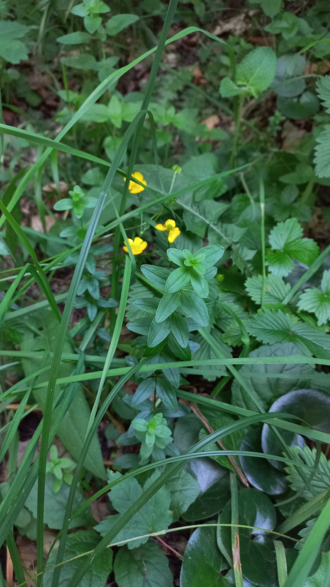

# Čerkáč hájny
- Lat.: Lysimachia nemorum
- En.: Yellow pimpernel

Čeľaď: Prvosienkovité (Primulaceae)

- 10-30cm trvalka
- Vyskytuje sa v miernom pásme Európy
- Rastie vo vlhkých pôdach

Zdr.:
- https://botany.cz/cs/lysimachia-nemorum/